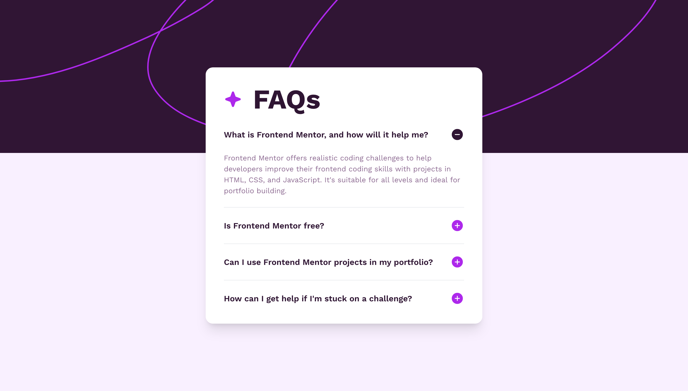

# Frontend Mentor - FAQ accordion solution

This is a solution to the [FAQ accordion challenge on Frontend Mentor](https://www.frontendmentor.io/challenges/faq-accordion-wyfFdeBwBz). Frontend Mentor challenges help you improve your coding skills by building realistic projects.

## Table of contents

- [Overview](#overview)
  - [The challenge](#the-challenge)
  - [Screenshots](#screenshots)
  - [Links](#links)
- [Built with](#built-with)

## Overview

### The challenge

Users should be able to:

- Hide/Show the answer to a question when the question is clicked
- Navigate the questions and hide/show answers using keyboard navigation alone
- View the optimal layout for the interface depending on their device's screen size
- See hover and focus states for all interactive elements on the page

### Screenshots

### Links

- Solution URL: [github.com/stay-js/fm-faq-accordion](https://github.com/stay-js/fm-faq-accordion)
- Live Site URL: [fm-faq-accordion.znagy.hu](https://fm-faq-accordion.znagy.hu)

## Built with

- **Deployment**: [Vercel](https://vercel.com)
- [Next.js](https://nextjs.org)
- [Headless UI](https://headlessui.dev)
- [Tailwind CSS](https://tailwindcss.com)
